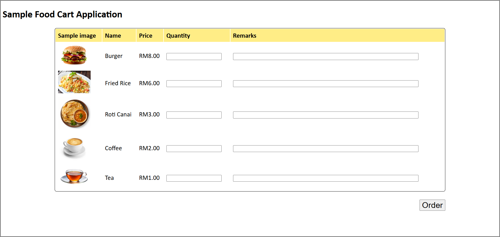
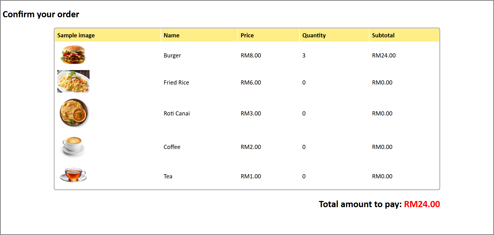

## Tutorial 7 - Extended testing workflow using GitHub Actions

## Description of Dessert Cart Web Application
A web-based dessert cart system that allows the cashier to select desserts from the menu and add them to the cart. The cart will display the selected desserts and quantity, as well as the total amount to pay.
 
#### Interface of [menu.php](swe30009/menu.php)

#### Interface of [cart.php](swe30009/cart.php)

